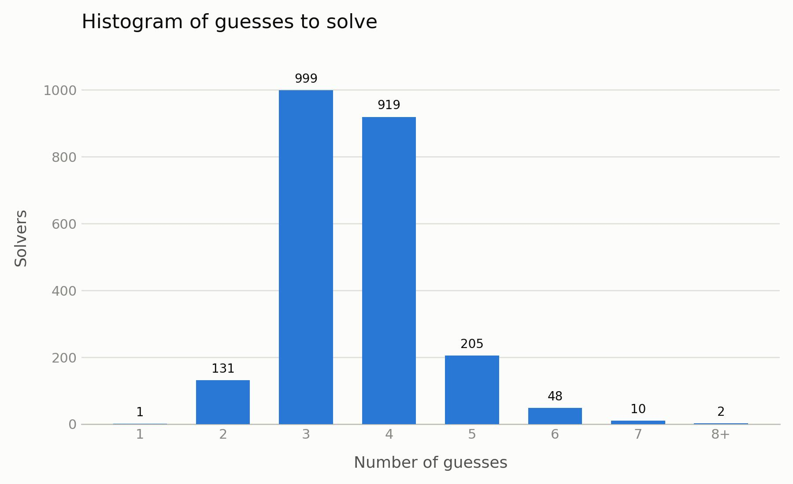
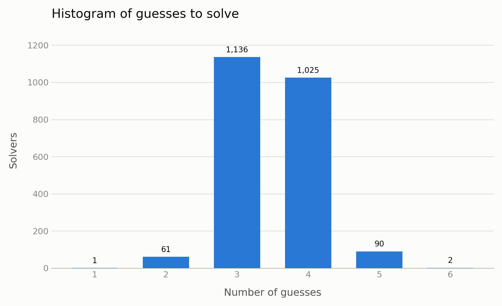

# Results

## Strategy 1

Choose legal candidate with highest entropy.

### Time (Measure-Command)
```
Days              : 0
Hours             : 0
Minutes           : 0
Seconds           : 16
Milliseconds      : 930
Ticks             : 169301848
TotalDays         : 0.000195951212962963
TotalHours        : 0.00470282911111111
TotalMinutes      : 0.282169746666667
TotalSeconds      : 16.9301848
TotalMilliseconds : 16930.1848
```
### Scores



## Strategy 2

Illegal candidates can still be used if they have higher entropy

### Runtime

```
Days              : 0
Hours             : 0
Minutes           : 0
Seconds           : 52
Milliseconds      : 75
Ticks             : 520755130
TotalDays         : 0.000602725844907407
TotalHours        : 0.0144654202777778
TotalMinutes      : 0.867925216666667
TotalSeconds      : 52.075513
TotalMilliseconds : 52075.513
```
### Scores

